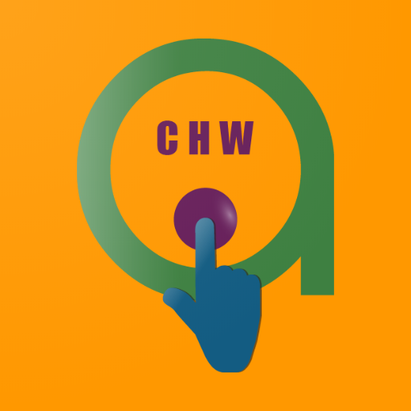

# Afya-Tek CHW Mobile Application
> Afya-Tek is a program that is reimagining primary healthcare systems to be centered a round people not health institutions. The system puts people at the center of care so that services are personalized to their needs, coordinated across all actors within the primary health system, and of the highest quality.

> Afya Tek empowers and connects actors within the primary health system Community Health Workers, Drug Dispensers and health workers at primary health facilities so that they have the tools and support to deliver high quality care, and ensure that no one is left behind. Managers within the health system are also equipped with data to help them make informed, timely program, budget and policy decisions

## Getting Started
These instructions will get you a copy of the project up and running on your local machine for development and testing purposes. See deployment for notes on how to deploy the project on a live system.

## Prerequisites
[Tools and Frameworks Setup](https://smartregister.atlassian.net/wiki/spaces/Documentation/pages/6619207/Tools+and+Frameworks+Setup)

## Development setup

### Steps to set up
[OpenSRP android client app build](https://smartregister.atlassian.net/wiki/spaces/Documentation/pages/6619236/OpenSRP+App+Build)

### Running the tests

[Android client unit tests](https://smartregister.atlassian.net/wiki/spaces/Documentation/pages/65570428/OpenSRP+Client)

## Deployment
[Production releases](https://smartregister.atlassian.net/wiki/spaces/Documentation/pages/1141866503/How+to+create+a+release+APK)

## Features
-   Child health care
-   Antenatal care (ANC)
-   Postnatal care (PNC)
-   Adolescent care 
-   Referral management 
-   Service Activity
-   All Families register

## Versioning
We use SemVer for versioning. For the versions available, see the tags on this repository.
For more details check out <https://semver.org/>

## Authors/Team 
-   The D-tree team
-   See the list of contributors who participated in this project from the [Contributors](../../graphs/contributors) link

## Contributing
[Contribution guidelines](https://smartregister.atlassian.net/wiki/spaces/Documentation/pages/6619193/OpenSRP+Developer+s+Guide)

## Documentation
Wiki [OpenSRP Documentation](https://smartregister.atlassian.net/wiki/spaces/Documentation)

## Support
Email: <mailto:techteam@d-tree.org>
Slack workspace: <opensrp.slack.com>

## Other Afya-Tek Components
-   [Health Facility](https://github.com/d-tree-org/opensrp-client-hf)
-   [Addo](https://github.com/d-tree-org/opensrp-client-addo)

## License
This project is licensed under the Apache 2.0 License - see the LICENSE.md file for details
